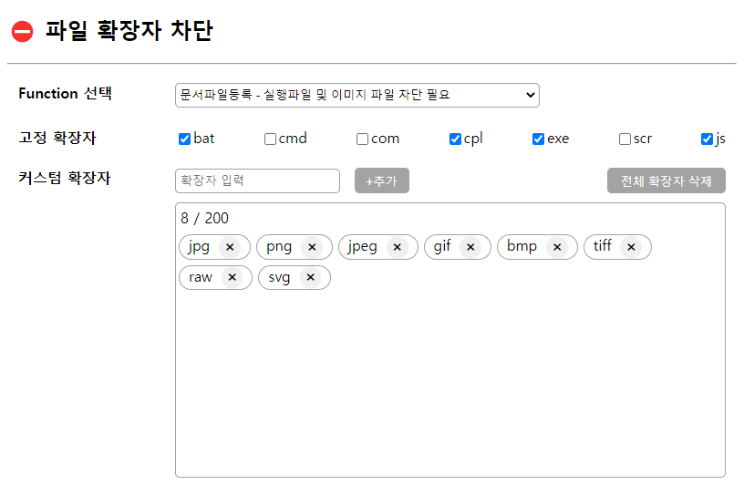

# ⛔ 파일 확장자 차단
작성자 : _지원자 문찬웅_ 

[](http://175.192.33.235/flow/) <br>
[⛔ 파일 확장자 차단 데모페이지 링크](http://175.192.33.235/flow/)

---
### 과제 수행 내용
> 필수 고려사항 **(완료)**
>> 1-1. 고정 확장자는 차단을 자주하는 확장자를 리스트이며, default는 unCheck되어져 있습니다.
> 
>> 1-2. 고정 확장자를 check or uncheck를 할 경우 db에 저장됩니다. - 새로고침시 유지되어야합니다.
>> (아래쪽 커스텀 확장자에는 표현되지 않으니 유의해주세요.)
> 
>> 2-1. 확장자 최대 입력 길이는 20자리
> 
>> 2-2. 추가버튼 클릭시 db 저장되며, 아래쪽 영역에 표현됩니다.
> 
>> 3-1. 커스텀 확장자는 최대 200개까지 추가가 가능
> 
>> 3-2. 확장자 옆 X를 클릭시 db에서 삭제
- 페이지 로딩 시 기본 데이터 획득 (function 목록, default 확장자 목록)
- REST API를 통해 확장자를 조회하거나 추가 또는 삭제

### 구현 시 고려사항
- '파일 확장자 차단'이라는 기능의 사용성을 고려하여 function 이라는 항목을 두어 각 function 마다 확장자를 설정할 수 있도록 함
- 커스텀 확장자 추가시 여러가지 제한 사항
    - 글자수 제한 (요건)
    - 추가 개수 제한 (요건)
    - 특수문자 제한
    - 고정 확장자에 포함되어 있는지 확인
    - 이미 추가되어있는 확장자인지 확인
- 커스텀 확장자를 추가한 순서대로 시각화
- 전체 확장자 삭제 기능 추가
---
### 개발 환경 및 언어
- JAVA 8
- spring framework 5.3
- mybatis 3.5
- postgreSQL 14.4
- javascript, jQuery, html, css
---
### DB
- **ERD**
  <br>
   <br><br>

- **테이블**
  - functions_tbl (확장자 차단을 적용할 기능에 대한 테이블)
  - extensions_tbl (고정/커스텀 확장자에 대한 테이블)
  - m_func_extension (기능과 확장자를 맵핑시키는 테이블)
    <br><br>

- **확장자 추가**
  1. **extensions_tbl**에 입력한 확장자가 존재하지 않으면 확장자를 추가
  2. **m_func_extension**에 function과 확장자를 맵핑하는 로우 추가
<br><br>

- **확장자 삭제**
  1. **m_func_extension**의 로우만 삭제
  2. 사용자들이 어떠한 확장자 차단을 필요로했는지 데이터를 얻기위해 **extensions_tbl**의 데이터 삭제는 보류

---
### API 명세
- **[GET]**  /functions/{funcKey}/extensions  
  - 특정 function에 적용된 확장자 리스트
     ```
     // [RESPONSE]
     {
        "extensionList" : [
           {
              "funcKey" : 1,
              "exKey" : 1,
              "code" : "exe",
              "defaultYn" : false
           },
           ...
        ]
     }
     ```

- **[POST]** /extensions
  - 확장자 저장
     ```
     // [REQUEST]
     {
        "funcKey" : 1,
        "code" : "exe"
     }
     ```

- **[DELETE]** /extensions/{funcKeyAndCode}
  - 단일 확장자 삭제 'funcKey,code' 형식으로 전송 (ex. /extensions/1,exe)
  - 전체 확장자 삭제 'funcKey' 전송 (ex. /extensions/1)
---
### etc.
```
-- DDL
CREATE TABLE public.extensions_tbl (
	ex_key serial4 NOT NULL,
	code varchar(20) NOT NULL,
	default_yn bool NOT NULL DEFAULT false,
	CONSTRAINT extensions_tbl_un UNIQUE (code)
);
CREATE TABLE public.functions_tbl (
	func_key serial4 NOT NULL,
	"name" varchar(45) NOT NULL,
	description varchar(100) NULL
);
CREATE TABLE public.m_func_extension (
	func_key int4 NOT NULL,
	ex_key int4 NOT NULL,
	cre_date timestamp NULL DEFAULT now()
);
```
```
-- default data
INSERT INTO public.extensions_tbl
(ex_key, code, default_yn)
VALUES(1, 'bat', true);
INSERT INTO public.extensions_tbl
(ex_key, code, default_yn)
VALUES(2, 'cmd', true);
INSERT INTO public.extensions_tbl
(ex_key, code, default_yn)
VALUES(3, 'com', true);
INSERT INTO public.extensions_tbl
(ex_key, code, default_yn)
VALUES(4, 'cpl', true);
INSERT INTO public.extensions_tbl
(ex_key, code, default_yn)
VALUES(5, 'exe', true);
INSERT INTO public.extensions_tbl
(ex_key, code, default_yn)
VALUES(6, 'scr', true);
INSERT INTO public.extensions_tbl
(ex_key, code, default_yn)
VALUES(7, 'js', true);

INSERT INTO public.functions_tbl
(func_key, "name", description)
VALUES(1, '문서파일등록', '실행파일 및 이미지 파일 차단 필요');
INSERT INTO public.functions_tbl
(func_key, "name", description)
VALUES(2, '이미지파일등록', '각종 문서파일 차단 필요');
```
